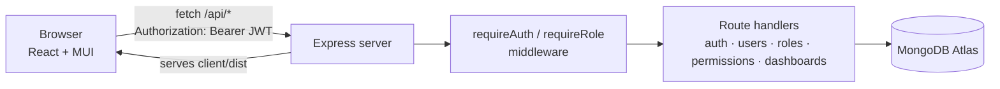

# InsightBoard — Full-Stack Analytics Admin Dashboard

A full-stack admin dashboard built with **React + Material UI** on the front end and **Node.js / Express + MongoDB** on the back end. It includes JWT authentication, role-based access control (RBAC), user / role / permission management, account settings, and 40+ dashboard, app and UI pages.

🔗 **Live demo:** https://analytics-dashboard-fullstack.onrender.com

> On the login page, click **“Log in as Demo Admin”** — no sign-up needed.
> The demo runs on Render's free tier, so the first visit after a quiet period can take **about a minute** while the server wakes up.

---

## Highlights

- **Authentication** — register, log in and log out with JWT (7-day tokens); passwords hashed with bcrypt; every dashboard page is behind a protected route that sends you back to the page you asked for after login.
- **Role-based access control** — 5 roles (Administrator, Manager, Editor, Support, Subscriber). The UI hides actions you can't use, and the API enforces the same rules with `requireAuth` + `requireRole` middleware (returns `403` otherwise).
- **User management** — searchable, filterable, paginated user list with server-side queries; create / edit / delete users; user detail page.
- **Roles & permissions** — edit a role's module permissions (read / write / create) and manage the permission list.
- **Account settings** — profile, password change, plan & billing, notification preferences (saved to the database), connected accounts, and account deletion.
- **Dashboards & apps** — Analytics, CRM and eCommerce dashboards, plus Email, Chat, Calendar and Invoice apps.
- **Pages** — user profile, pricing, FAQ, help center, and full-screen status pages (404, coming soon, under maintenance, not authorized).
- **UI kit & forms** — typography, icons, 6 card styles, a component gallery, form elements and layouts, hand-written form validation, multi-step form wizard, checkout wizard and 7 dialog patterns.
- **Data** — a hand-built sortable / selectable MUI Table **and** the same data in MUI DataGrid; 8 ECharts chart types, some drawn from live database stats.
- **Light / dark mode** and a responsive, collapsible sidebar.
- **Self-seeding database** — on first start with an empty database, the server creates the roles, permissions, demo users and the demo admin.

---

## Tech Stack

| Layer | Tools |
|---|---|
| Front end | React 18, Vite, Material UI v7, MUI X DataGrid, React Router v7, Apache ECharts (`echarts-for-react`) |
| Back end | Node.js, Express, Mongoose, JSON Web Tokens, bcryptjs |
| Database | MongoDB Atlas |
| Hosting | Render (Express serves both the API and the built React app) |

---

## Architecture



1. The user logs in → the server checks the password with bcrypt and returns a signed JWT plus the role's permissions.
2. The React app stores the token and sends it with every API request (`src/api/client.js`).
3. Protected endpoints verify the token (`requireAuth`) and the role (`requireRole`) before touching the database.

### Who can do what (enforced by the API)

| Action | Admin | Manager | Editor | Support | Subscriber |
|---|:-:|:-:|:-:|:-:|:-:|
| View users, roles & permissions | ✅ | ✅ | ✅ | ✅ | ✅ |
| Create / edit / delete users | ✅ | ✅ | — | — | — |
| Create another Administrator | ✅ | — | — | — | — |
| Create / edit / delete roles & permissions | ✅ | — | — | — | — |
| Edit own profile & settings | ✅ | ✅ | ✅ | ✅ | ✅ |

The demo admin account is locked: its email, username and password can't be changed, and it can't be deleted, so the live demo always stays usable.

---

## Project Structure

```
analytics_dashboard/
├── client/                    # React app (Vite)
│   └── src/
│       ├── api/client.js      # fetch wrapper: base URL, JSON, JWT header
│       ├── auth/AuthContext.jsx   # logged-in user, login / logout, role helpers
│       ├── components/        # Sidebar, Headerbar, ProtectedRoute, shared UI
│       ├── data/              # shared front-end data (plans, etc.)
│       └── pages/             # one folder per section
│           ├── auth/  users/  roles/  permissions/
│           ├── account/  profile/  pricing/  faq/  help/  misc/
│           ├── ui/  forms/  tables/  charts/  examples/
│           └── *Page.jsx      # dashboards and apps
└── server/                    # Express API
    ├── server.js              # app setup, routes, static file serving
    ├── middleware/auth.js     # signToken, requireAuth, requireRole
    ├── mongoose/
    │   ├── models/            # User, Role, Permission, ...
    │   ├── routes/            # auth, users, roles, permissions, dashboards ...
    │   └── scripts/           # seed scripts (auth data seeds automatically)
    └── data/                  # JSON data for dashboards and apps
```

---

## Getting Started (local)

**Requirements:** Node.js 18+ and a MongoDB connection string (local MongoDB or a free MongoDB Atlas cluster).

### 1. Clone and install

```bash
git clone https://github.com/chenxi-debugger/analytics_dashboard.git
cd analytics_dashboard

cd server && npm install
cd ../client && npm install
```

### 2. Environment variables

Create `server/.env`:

```env
MONGO_URI=your-mongodb-connection-string
JWT_SECRET=a-long-random-string
PORT=5001
# optional: password for the seeded demo admin (defaults to Admin@123)
# DEMO_ADMIN_PASSWORD=
```

Create `client/.env`:

```env
VITE_API_URL=http://localhost:5001
```

> If `JWT_SECRET` is missing, the server falls back to a random secret and prints a warning. Everyone gets logged out on each restart, so set it.

### 3. Run

```bash
# terminal 1
cd server
npm run dev          # http://localhost:5001

# terminal 2
cd client
npm run dev          # http://localhost:5173
```

On first start the server seeds the roles, permissions and demo users automatically. Then open http://localhost:5173 and click **Log in as Demo Admin**.

### 4. Production build

```bash
cd client && npm run build    # outputs client/dist, which Express serves
```

---

## API Overview

| Method | Endpoint | Auth | Description |
|---|---|---|---|
| POST | `/api/auth/register` | — | Create an account (Subscriber role) |
| POST | `/api/auth/login` | — | Log in, returns JWT + permissions |
| GET | `/api/auth/me` | user | Current user and permissions |
| PUT | `/api/auth/me` | user | Update own profile / plan / notification settings |
| PUT | `/api/auth/password` | user | Change password |
| DELETE | `/api/auth/me` | user | Delete own account |
| GET | `/api/users` | — | List users (`q`, `role`, `plan`, `status`, `page`, `limit`) |
| GET | `/api/users/stats` | — | Totals by status and role |
| GET | `/api/users/:id` | — | One user |
| POST / PUT / DELETE | `/api/users[/:id]` | Admin, Manager | Manage users |
| GET | `/api/roles` | — | Roles with module permissions |
| POST / PUT / DELETE | `/api/roles[/:id]` | Admin | Manage roles |
| GET | `/api/permissions` | — | Permission list |
| POST / PUT / DELETE | `/api/permissions[/:id]` | Admin | Manage permissions |

Dashboard and app data come from `/api/analytics`, `/api/crm`, `/api/ecommerce`, `/api/email`, `/api/chat` and others.

---

## Deployment (Render)

One **Web Service** runs everything:

- **Root directory:** `server`
- **Build command:** `npm install && cd ../client && npm install && npm run build` (installs the server, then builds the React app into `client/dist`)
- **Start command:** `node server.js`
- **Environment variables:** `MONGO_URI`, `JWT_SECRET` (and optionally `DEMO_ADMIN_PASSWORD`)

The client's `.env.production` points `VITE_API_URL` at the Render URL.

---

## Credits

The UI layout is inspired by the Sneat admin template. All code in this repository was written for this project. No template source code is included.

## Author

**Chenxi Zhuang** — [GitHub @chenxi-debugger](https://github.com/chenxi-debugger) · [Portfolio](https://portfolio-chenxi.vercel.app)
